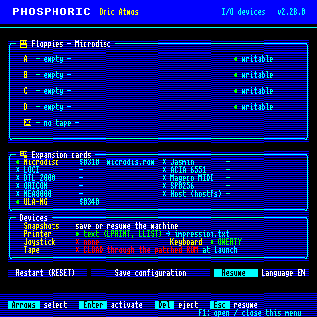

# Phosphoric

An ORIC-1 / Atmos emulator written in C11, **cycle-stepped**: the master clock
advances the whole machine one cycle at a time (ULA fetch → CPU bus access →
peripherals), the 6502 core is **100 % exact against the SingleStepTests/65x02
oracle** (2 440 000 cases, NMOS dummy accesses included), and VIA, ULA and PSG
are clocked at hardware rate. What that claim covers — and what it does not (the
FDC is still timed by fixed delays, the absolute raster/CPU phase is unobservable
on a stock ORIC and therefore not modelled) — is spelled out component by component in
[docs/ACCURACY.md](docs/ACCURACY.md), with the test that would falsify each line.

**Version: 2.29.1** | **70 test suites (1,362 checks), 100% pass** | **Zero memory leaks** | **Runs natively on Linux / Windows / macOS (CI-verified) & in the browser (WebAssembly)**

```
 ____  _                      _                _
|  _ \| |__   ___  ___ _ __ | |__   ___  _ __(_) ___
| |_) | '_ \ / _ \/ __| '_ \| '_ \ / _ \| '__| |/ __|
|  __/| | | | (_) \__ \ |_) | | | | (_) | |  | | (__
|_|   |_| |_|\___/|___/ .__/|_| |_|\___/|_|  |_|\___|
                       |_|
```

## Quick Start

```bash
# Install dependencies (Debian/Ubuntu)
sudo apt-get install build-essential libsdl2-dev

# Build with SDL2
make SDL2=1

# Boot ORIC-1 BASIC
./oric1-emu -r roms/basic10.rom

# Boot ORIC Atmos BASIC (auto-detected)
./oric1-emu -r roms/basic11b.rom

# Load a tape program (fast load: direct memory injection)
./oric1-emu -r roms/basic10.rom -t program.tap -f

# Load a tape via the real ROM at signal level (for custom/protected loaders)
./oric1-emu -r roms/basic10.rom -t soccermanager.tap --tape-signal

# Boot Sedoric from disk
./oric1-emu -r roms/basic10.rom --disk-rom roms/microdis.rom -d SEDO40u.DSK
```

## Features

### Core Emulation
- **MOS 6502 CPU — cycle-stepped** (default since v1.124.0): every cycle emits its own bus
  access, NMOS dummy accesses included; **100,00 % exact bus sequence on 2 440 000 cases** of
  the SingleStepTests/65x02 oracle. IRQ/NMI are sampled at the **penultimate cycle**, so
  `SEI` does not shield the next instruction from an already-pending IRQ, `CLI`/`PLP` delay it
  by one instruction, and an NMI hijacks a `BRK` in flight. 256/256 opcodes (151 official +
  105 illegal), 13 addressing modes, NMOS decimal mode, level-triggered IRQ. The historical
  core (bus-cycle ordered, 44,26 % exact) stays available via `--cpu-legacy`.
  See [docs/ACCURACY.md](docs/ACCURACY.md).
- **64KB Memory** — RAM ($0000-$BFFF), ROM ($C000-$FFFF), banking, I/O routing
- **VIA 6522** — 16 registers, Timer 1/2, IFR/IER interrupts, keyboard matrix, shift register (8 modes), T2 pulse counting, **complete CA2/CB2 PCR modes** (input edges, independent interrupts, handshake — CB2 write-only like silicon —, 1-cycle pulse, manual) and IRA/IRB input latching (ACR bits 0-1); timer, PB7 and shift-register behaviour **measured on a real 6522** (2.6.0, from Neo6502Vic20's VICE VIC-20 test runs); **exact lazy path** (2.7.0): cycles where nothing can happen are only counted and applied before the next access — same behaviour as stepping every cycle (`make test-via-lazy`), 20-30 % faster
- **ULA Video** — Text mode (40x28) + HIRES (240x200), serial attributes, PAL timing (312 lines x 64 cycles)
- **AY-3-8910 PSG** — 3 tone channels, noise, 16 envelope shapes, SDL2 audio output
- **Microdisc** — WD1793 FDC, 4 drives (A-D), overlay ROM, Sedoric disk boot. **Real mechanical timing by default** (step rates 6/12/20/30 ms, 300 RPM rotational latency, Record-Not-Found after 5 index pulses, live Type I index pulse; `--fdc-timing fast` restores instant-feel legacy delays). **Bad-sector fault injection** (`--bad-sector [D:]S:T:N`, damage follows the media across drive select/hot-swap, persisted in save states)
- **Cassette** — TAP format, CLOAD/CSAVE via ROM patching, fast load mode, multi-block support, post-CLOAD rechain, and **signal-level playback** (`--tape-signal`: real VIA CB1 waveform for custom/protected loaders)
- **ACIA 6551** — Serial controller at $031C-$031F, transports loopback/TCP/PTY/COM/file + protocol backends (modem AT, PicoWiFiModemUSB; `digitelec` deprecated → use `--dtl2000`), V23 mode (Minitel/Digitelec). See the *chips × transports* matrix below
- **Digitelec DTL 2000** — Faithful PIA 6821 + ACIA 6850 modem card at $03F8-$03FD (OCR-verified registers, V23 75/1200 & symmetric 1200, line/carrier control, IRQ wired)
- **Mageco / ORICON MIDI** — MC6850 ACIA driving the MIDI DIN sockets (31250 baud 8-N-1, forum t=2525). Two designs from the thread: the original **Mageco** card at $03FE-$03FF (`--mageco`) and the modern **ORICON** reboot at $031C-$031D + clock generator $031E-$031F, LOCI-compatible (`--oricon`). Capture/replay the raw MIDI stream with `--mageco file:in[:out]`; play a Standard MIDI File **into** the Oric with `--mageco smf:song.mid[:loop]` (timed MIDI IN at the song's tempo); or — in a `MIDI=1` build — `--mageco midi[:TARGET]` opens a live host MIDI port (ALSA "Phosphoric MIDI" on Linux, CoreMIDI on macOS, WinMM on Windows) so the emulated Oric drives FluidSynth/a DAW and a MIDI keyboard plays into the Oric. The byte stream matches a real Oric+Mageco card through a USB-MIDI interface
- **PicoWiFiModemUSB** — Emulation of sodiumlb's WiFi modem (Pico W, USB CDC ↔ WiFi) exposed by LOCI as an ACIA at $0380. Complete v0.1.0 AT command set (`--serial picowifi[:SSID[:PASS]]`). Simulated WiFi, data connections over real TCP.
- **LOCI** — Lovely Oric Computer Interface (sodiumlb 2024): MIA bus $03A0-$03BF, 36/36 API ops (errno ABI FatFS 32+FRESULT, dir fd 64+, xstack 512, all firmware-compliant), USB HID, cycle-clocked WD1793 (flat image model), FAT16/32 SD image, runtime ROM swap (`--loci`, `--loci-flash DIR`, `--loci-sdimg PATH`). **Action button (F8)**: short press → session snapshot + LOCI menu (locirom v0.3.0, FW version and timings patched into the ROM like the real firmware), the menu's *resume* entry → back to the session; **long press (≥ 2 s) → Mike Brown's diag ROM** (test108k). **Device list** in the menu browser ("0: Internal storage", USB stick, picowifi "CDC modem mounted") and **real host USB sticks** served to the Oric (`--loci-usb DIR`, auto-detection of /media/$USER, volume paths `N:`). Adjustable MIA bus timing (`MAP_TUNE_*`, `ADJ_SCAN` sweep visible live). Boots a complete Sedoric V4 master through the LOCI firmware. See [docs/loci.md](docs/loci.md).

### ORIC-1 & Atmos Support
- **ROM auto-detection** — Detects BASIC 1.0 (ORIC-1) or 1.1 (Atmos) from ROM header
- **`--model` CLI flag** — Force model selection (`oric1`, `atmos`, `1.0`, `1.1`)
- **ROM-specific tape patching** — Correct patch addresses for both ROM versions

### IJK Joystick
- **IJK interface** — Most common ORIC joystick adapter (active low on PSG Port A)
- **Keyboard mode** — Arrow keys + RCtrl/RAlt as fire (`-j keys`)
- **Gamepad mode** — SDL2 game controller with D-pad, analog stick, A/B/X fire (`-j gamepad`)
- **Hot-plug** — Game controllers detected automatically
- **Blending** — Joystick and keyboard signals combined on Port A

### Centronics Printer & MCP-40 Plotter
- **LPRINT/LLIST capture** — Printer output saved to text file (`-p output.txt`)
- **MCP-40 plotter** — 4-color pen plotter emulation (`--printer-type mcp40`)
- **Plotter commands** — H (Home), D (Draw), M (Move), J (Color), P (Print), L (LineType)
- **480x400 framebuffer** — Bresenham line drawing, 5x7 font, BMP export
- **Centronics protocol** — VIA Port A data + CA2 STROBE edge detection

### Save States
- **`.ost` format** — Binary save state with CRC32 integrity check
- **20 section types** — CPU, MEM, VIA, PSG, VID, CLK, KBD, FDC, MDC, DSK, BAD, TAP, SER, META + one per bus device: UNG (ULA-NG), MAG (Mageco), DTL (DTL 2000), JAS (Jasmin), SPO (SP0256), MEA (MEA8000) (CRC32, unknown sections ignored = backward/forward compatible)
- **Exact resume point** — a state taken mid-frame resumes with the same raster position,
  VIA cycle state and interrupt sample as an uninterrupted run (`make test-savestate-determinism`)
- **Resume in the middle of a disk transfer** — the sector being read or written is recomputed
  on load (Microdisc and Jasmin, 2.4.0); device sections are written field by field and
  versioned, without ROMs, host resources or tables that can be recomputed
- **Hotkeys** — F2 (quick save), F4 (quick load)
- **CLI** — `--save-state FILE`, `--load-state FILE`

### Interactive Debugger
- **Breakpoints** — Up to 16 PC breakpoints, conditional (`b ADDR if EXPR`), 8 raster-line breakpoints (`br LINE`)
- **Watchpoints** — Up to 8 memory write watchpoints
- **Commands** — step, next, **step-out**, continue, **undo** (rewind 16 snapshots CPU+RAM), registers, set, disassembly (paginated with symbol-resolved operands), memory dump+edit, **inline assembler** (`a ADDR MNEMONIC [operand]`), **memory search** (`find B1 B2…` / `find "text"`), stack
- **Live peripheral introspection** — `via`, `psg`, `disk`/`fdc`, `acia`/`serial`, `tape`, `loci` snapshots
- **Symbols** — Load `.sym`/`.lab`/EQU/VICE formats with `--symbols FILE`. Disasm and trace operands auto-annotated.
- **TUI mode** — ncurses 6-pane interface (regs, stack, disasm, mem, bp+wp, status). Build with `TUI=1`, launch with `--tui`.
- **GDB remote stub** — debug the 6502 from `gdb`/lldb/IDE (VS Code, CLion): `--gdb[=PORT]` then `target remote :PORT`; listens on 127.0.0.1 only unless `--gdb-bind ADDR` is given (the stub has no authentication). Breakpoints, single-step, registers and memory over the GDB RSP. *(No other Oric emulator offers this.)*
- **CLI** — `--debug` (break at start), `--break ADDR`

### IPC Control Mode (OricForge IDE integration)
- **`--control` flag** — Phosphoric speaks a text protocol on stdin/stdout, logs on stderr.
- **30 commands** : `hello`, `regs`, `set`, `read`, `bread` (binary), `write`, `peek <subsys>`, `break`, `unbreak`, `break-list`, `watch`, `raster`, `step`, `next`, `step-out`, `continue`, `pause`, `reset`, `quit`, `load-tap`, `load-rom`, `load-sym`, `load-disk`, `eject-disk`, `eject-tape`, `loci-button [long]`, `disasm`, and more.
- **3 event types** : `EVT ready`, `EVT stopped reason=…`, `EVT halt reason=…`.
- **Async pause** while running, capability negotiation via `hello`, SIGPIPE safe.
- **Python smoke client** (`tests/integration/phos_smoke_client.py`) — stdlib only, ~250 LOC reference implementation.
- **Spec** : [docs/control_protocol.md](docs/control_protocol.md)

### HTTP Control API (REST)
- **`--http-api[=PORT]`** (build with `HTTPAPI=1`) — the same command set exposed
  over HTTP/JSON on a dedicated port (default 8888), for scripting, browser
  dashboards and e2e tests. Reuses the `--control` dispatch; no logic duplicated.
- **Endpoints** : `GET /hello /regs /mem?addr=&len= /peek/{via|psg|disk|acia|tape|loci}` ;
  `POST /reset /mem /keys /tape /disk/{A-D} /exec/{step|next|step-out|continue|pause}` ;
  `DELETE /tape /disk/{A-D}`. Replies are JSON (`{"ok":true,"reply":…}` / `{"ok":false,"error":…}`), CORS-enabled.
- **Type at the keyboard remotely** : `POST /keys` with `text=…` (`\n` = RETURN) drives
  a full BASIC program over HTTP — e.g. `curl -X POST --data-urlencode 'text=PRINT 2+2\n' :8888/keys`.
- **Safe by default** : binds `127.0.0.1` (expose with `--http-api-bind 0.0.0.0`);
  file ops (`/tape`, `/disk`) are sandboxed to `--http-api-root DIR` (absolute
  paths and `..` rejected). Commands run on the emulator thread at frame boundaries.
- **Spec** : [docs/http-api.md](docs/http-api.md)

### Chromecast Streaming
- **MJPEG server** — HTTP stream at `/stream` (720x672, 3x upscale)
- **WAV audio** — Real-time PSG audio streaming at `/audio`
- **Native CASTV2** — Direct Chromecast control via `--cast-to`
- **mDNS discovery** — `--cast-discover`

### Display Scaling
- **Integer scaling** — x1 (240x224), x2 (480x448), x3 (720x672, default), x4 (960x896)
- **Pixel-perfect** — Nearest-neighbor upscaling, no blur
- **Runtime toggle** — F3 cycles through scale factors
- **CLI** — `--scale N` (1, 2, 3, 4)

### ULA-NG (next-gen ULA)
- **Software reference** for a future Verilog/FPGA ULA (Sipeed Tang Primer 20K /
  GW2A-18). Register window `$0340-$035F`, **locked at reset** → bit-for-bit
  identical to a stock HCS 10017 until a program unlocks it (`'N','G'` on
  `$0340`). Locked at reset (indistinguishable from an HCS 10017); no CLI flag needed.
- **8 features** — palette-indirection (16×12-bit LUT), raster IRQ, start-address
  (double-buffer/scroll), scanline copper, fine scroll X/Y, **parallel attributes**
  (per-cell ink+paper, no color clash), **16 hardware sprites** 16×16 with
  priority + collision, and **chunky 4bpp** (320×224, 16 colours) / **80-column
  text** modes.
- **Activation** — no BASIC keyword: `POKE`/machine-code register writes, or the
  emulator's `--ula-ng-poke "340=4E,340=47,341=05,…"` (startup injection).
- **Demos** — one per feature in [demos/ula-ng/](demos/ula-ng/) (`menu.sh`).
- **Docs** — user guide [docs/ula-ng/README-ULA-NG.md](docs/ula-ng/README-ULA-NG.md),
  spec [docs/ula-ng/ULA-NG-SPEC.md](docs/ula-ng/ULA-NG-SPEC.md).

### CPU Trace Logging
- **Instruction trace** — Log every CPU instruction with disassembly and register state
- **CLI** — `--trace FILE` to enable, `--trace-max N` to limit
- **Output** — `CYCLES  PC  BYTES  DISASM  A=XX X=XX Y=XX SP=XX P=XX`

### AY-3-8910 PSG — hardware-rate clocking
- **Clocked at `clock/8` (125 kHz)**, the chip's real internal step, not at the output
  sample rate: tone `clock/(16·TP)`, noise LFSR `clock/(16·NP)`, envelope `clock/(8·EP)`
  — the last one used to be **2x too slow**.
- **Integrated output**: each sample averages the steps it covers, so anything above
  Nyquist **attenuates instead of aliasing** (a 62.5 kHz tone used to come out at
  18.4 kHz at full amplitude).
- Verified by **measuring the signal** (`make test-audio`): tone frequency within 0.1%
  of the datasheet formula, envelope within 2%, LFSR balanced and never stuck at zero.

### ULA video — cycle-level fetch
- **One 6-pixel cell per cycle** — the ULA fetches each cell at the cycle the real
  beam reads it, so a **mid-line CPU write only affects the cells not yet scanned**:
  raster splits inside a scanline are possible for the first time. Ink, paper and
  text attributes are a per-line serial state, as on the hardware.
- **`--ula-line`** restores the pre-V2 behaviour (whole scanline sampled at one
  instant); `--cpu-legacy` forces it, since an instruction is indivisible there.
- **Horizontal reference = the ULA's own counter** (Mike Brown's *Unofficial ULA
  Guide*, measured on hardware): columns 0-39 are fetched at counts 0-39 of the
  64-count line, blanking at 40-63, hsync at 49-52. `--ula-fetch-offset` stays as an
  experiment knob; its correct value is 0. The absolute raster/CPU phase is not
  observable by software on an unmodified ORIC (free-running counters, asynchronous
  reset). Proof: `make test-raster-split` (a real 6502 program) and `make test-clock`.

### Master clock
- **One call, one machine cycle** — `emu_cycle()` (`src/emu_clock.c`) advances the whole
  machine with a fixed intra-cycle order: CPU bus access → φ2 peripherals → ULA fetch of
  the same count. Peripherals are never batched: the clock hook always receives exactly
  one cycle.
- **Observable consequence** — a CPU write during cycle *c* is seen by cell *c* (the 6502
  accesses DRAM first, the ULA fetches afterwards in the same 1 µs — measured by Mike
  Brown). Until 2.0.1 the order was inverted and every raster split landed one cell too
  far right. Verified by `make test-clock`.

### Program start (`main`, src/main.c)
- **`main()` is 32 lines**: `cli_parse_args()` (`src/cli/cli_args.c`, the getopt switch) fills
  a `cli_opts_t`, then 14 named `main_setup_*` steps configure the machine (process,
  `phosphoric.cfg`, machine, input/printer, serial cards, recordings, LOCI, debug front-ends,
  captures, ROM/model, tape, disks/speech, services, tracing), `emulator_run()` runs it and
  `main_finish()` writes the outputs. Each step returns -1 to continue or the exit code.
- **Refactor safety net**: `tools/cli_golden.sh` replays `tests/cli_golden/cases.txt`
  (≈ 116 command lines) on a reference binary and the new one — exit code, stdout, stderr and
  every produced file must match (`make test-cli-golden GOLDEN_REF=…`).

### Frame loop (`emulator_run`, src/main.c)
- **One frame = one instruction loop + named end-of-frame steps**, in a fixed,
  observable order: `run_frame_instructions` (debugger, trace, profiler, tape patches
  around `emu_step`) → LOCI co-sim hooks → headless audio sinks → control/GDB polling →
  fast-load phases → auto-type arming and stepping (native matrix or LOCI HID) → serial
  trace flush, cast frame, HTTP-API drain, queued keys → `run_present_and_events` (F1 peripherals menu, F6 OSD,
  SDL events: `sdl_osd_key`, `sdl_function_key`, `sdl_mouse_event`) → timed captures →
  frame dump / AVI → conditional captures → pokes → pacing (50 Hz limiter or `--realtime`)
  → exit conditions (movie done, `-c` limit, JAM).
- The shared run state (cycles, frames, bench and real-time clocks) lives in `run_state_t`;
  each step is a `static` function of at most ~150 lines (2.0.3 — was a single
  1 300-line function). Contract: [docs/architecture/master-clock.md](docs/architecture/master-clock.md).

### Cycle Trace (accuracy instrument)
- **One line per CPU cycle** — `--cycle-trace FILE` (`--cycle-trace-max N` to cap):
  `CYCLE T ADDR DATA PC A X Y SP P FLAGS IRQ`, where `T` is `R`ead, `W`rite or
  `i`nternal. Meant to be diffed against another emulator or instrumented hardware.
- **`i` lines only with `--cpu-legacy`** — they are the padded internal cycles of the
  historical core; the default core emits a real bus access on every cycle.
  See [docs/ACCURACY.md](docs/ACCURACY.md).

### CPU conformance oracles
- **`make test-cycle`** — replays SingleStepTests/65x02 (10 000 cases per opcode,
  with the expected cycle-by-cycle bus trace) and scores four separate properties:
  final state, cycle totals, bus **subsequence** (the N2 property) and **exact bus
  sequence** (the N3 property). **Both cores are judged in one run**, so neither can
  progress by breaking the other.
- **`make test-dormann`** — Klaus Dormann's `6502_functional_test`: **passes in full**
  (success trap `$3469`, ~96 M emulated cycles).
- **Vectors are not vendored** — `tools/fetch_vectors.sh` (or `make fetch-vectors`)
  downloads them; both targets SKIP cleanly when they are absent.

### CPU Performance Profiler
- **Execution profiling** — Per-address hit counts and cycle usage across full 64K space
- **Opcode histogram** — Frequency distribution of all 256 opcodes
- **Hotspot report** — Top 20 addresses by execution count and cycle usage
- **CLI** — `--profile FILE` writes report on exit

### ROM Analysis Tools
- **Vector detection** — Extracts RESET, NMI, IRQ hardware vectors
- **Subroutine map** — Scans JSR/JMP targets with reference counts
- **String detection** — Finds ASCII strings in ROM (min 4 chars)
- **Usage statistics** — Code vs data vs fill byte classification
- **Pattern search** — Find arbitrary byte sequences in ROM
- **CLI** — `--rom-info [FILE]` prints to stdout or writes to file

### Modern Features
- **Video export** — PPM, BMP, ASCII screenshots; Motion-JPEG AVI recording (`--video`)
- **Input record/replay** — deterministic "TAS movie" of keyboard input (`--record`/`--replay`). Replay is bit-deterministic — tool-assisted runs, bug repro, CI regression. *(No other Oric emulator offers this.)*
- **Three native platforms + browser** — Linux, Windows and macOS all build
  natively and are **CI-verified** (build + full test suite), plus a zero-install
  WebAssembly build:
  - **Linux** — the reference platform (`make`; GCC/Clang + SDL2). Full feature set.
  - **Windows 11** — native `.exe` cross-built by CI (`windows-build` workflow:
    `oric1-emu.exe` + `SDL2.dll` + roms; or `make WIN=1 SDL2=1` with MinGW-w64).
    Also **WSL2** (full Linux build under WSLg). v1 native limits: serial
    tcp/pty/modem/com/picowifi, `--gdb`, `--control` async-pause, CAST and host
    MIDI are Linux/WSL2-only.
  - **macOS** (Intel & Apple Silicon) — native build via Apple clang + Homebrew
    SDL2 (`brew install sdl2 pkg-config` then `make`). PTY/COM serial use the
    BSD/POSIX paths, host MIDI uses CoreMIDI. **Verified on real Apple Silicon**
    by the `macos-build` CI (headless + SDL2 + full test suite). See
    [docs/macos.md](docs/macos.md).
  - **Browser** — the WebAssembly build is live at
    <https://benedictemarty.github.io/Phosphoric/> (zero install).
- **WebAssembly build** — runs in the browser (`make wasm`): full machine on a `<canvas>` with Web Audio, a JOric-style left icon rail (ROM selector, `.tap`/`.dsk` drag-drop, Reset, fullscreen, **CRT filter**, **`.ost` save/restore**), **TAPE/DISK activity LEDs**, and a faithful ORIC-1/Atmos on-screen keyboard — semi-transparent overlay, toggleable, with sticky CTRL/FUNCT/SHIFT (FUNCT hidden on ORIC-1). **Deep-link URL params** `?rom=oric1|atmos` and `?media=<file>.tap|.dsk` boot straight into a program (a `.dsk` auto-enables the Microdisc controller). **LOCI cartridge in the browser** (`?loci=1` or the LOCI rail button): boots the LOCI menu with a persistent internal flash (IndexedDB) — loaded files land in it and mount from the menu (`make test-web-loci`, Chrome headless e2e). **I/O** rail button = the F1 peripherals menu (F1 is kept from the browser); **MODEM** (`?modem=1`) = picowifi modem through a WebSocket relay (`tools/picowifi_ws_relay.py`) or `?relay=none` (`make test-web-iomenu`, `test-web-picowifi`). Output byte-identical to native. See [docs/wasm.md](docs/wasm.md).
- **Keyboard layouts** — QWERTY, AZERTY (`--keyboard azerty`)
- **Headless mode** — No display, for CI/automation
- **Peripherals menu (F1)** — full-screen menu, in French or English, to insert/eject floppies
  A–D (write-protect tab per drive), tape, snapshots, printer, joystick, keyboard layout,
  expansion cards; settings saved to `phosphoric.cfg` (see [Peripherals menu](#peripherals-menu-f1))
- **LOCI-USB plugged in** — used automatically at launch when no disk card is chosen and its
  LOCI firmware answers 'L' at `$0319` (`--no-auto-loci` to opt out; see [docs/loci.md](docs/loci.md))
- **Host filesystem** — Share files with `--hostfs DIR`
- **Expansion cards as modules** — each card (Microdisc, Jasmin, LOCI, ACIA, DTL 2000, Mageco/ORICON, SP0256, MEA8000, ULA-NG) is one file in `src/cards/` plus one line in `include/cards_list.h`; options, help, F1 menu, bus, ticks, save states and audio derive from it. Adding a card: see [docs/CARTES.md](docs/CARTES.md) (template `docs/examples/card_demo.c`, checked by `make test-card-template`)
- **Conversion tools** — `bas2tap`, `bin2tap`, `tap2sedoric` (Sedoric file injection: AUTO `.COM`, boot autoexec, multi-file/directory chaining), `sedoric-info` (disk inspector), `tap2wav` (`.tap` → cassette-audio `.wav`, playable on real hardware) and `dsk2hfe` (`.dsk` MFM_DISK → magnetic **HFE** image for HxC/Gotek/Greaseweazle) + RAW-chain scripts `sedoric_inject.py`/`dsk_raw2mfm.py`/`sedoric_mkbare.py` — see [docs/TOOLS.md](docs/TOOLS.md) and [docs/SEDORIC.md](docs/SEDORIC.md)
- **Keyboard automation** — `--type-keys CYCLES:TEXT` (escapes: `\n` Return, `\e` Esc, `\u\d\l\r` arrows, `\Cx` Ctrl+x, `\Fx` Funct+x, `\Lx`/`\Rx` Left/Right Shift+x, `\pN` pause). Key pacing is **synchronised on the real keyboard scanner** (VIA PB3 matrix sweep), so no keystroke is dropped even when the target program polls the matrix slower than a frame. `--type-keys-when ADDR:VAL:TEXT` arms typing when `RAM[ADDR]==VAL` (hex) instead of a guessed boot cycle. With `-f` (fast-load) of a BASIC program, `--type-keys` **no longer cancels the automatic `RUN`**: the auto-RUN stands down only when your own keystrokes fall inside its window (i.e. you are driving the boot yourself, typing your own `RUN`/`CLOAD`); keys aimed at the program's menus fire after it, in order. Validation tooling in `tools/keytest/` (172/172 keys on ORIC-1 + Atmos). Debugging a **custom (non-ROM) keyboard scanner** (a native game that sweeps the VIA+PSG matrix itself)? `--kbd-scan-trace FILE` logs one line per VIA Port B read — `col reg7 reg14 matrix PB3` — so you can see exactly what the emulator returns (`reg7` bit6=0 → PB3 forced low; `matrix`≠`FF` → keys held)

## Building

### Prerequisites

```bash
# Debian/Ubuntu
sudo apt-get install build-essential libsdl2-dev

# Fedora
sudo dnf install gcc SDL2-devel

# Arch
sudo pacman -S base-devel sdl2

# Optional: Chromecast support
sudo apt-get install libssl-dev
```

### Build

```bash
make                           # Standard build with SDL2 (default)
make SDL2=0                    # Headless build (no SDL2, for CI/automation)
make DEBUG=1                   # Debug build (-g -O0)
make CAST=1                    # With Chromecast support
make MIDI=1                    # With real-time host MIDI (ALSA/CoreMIDI/WinMM, --mageco midi)
make wasm                      # WebAssembly/browser build (needs Emscripten; see docs/wasm.md)
make tools                     # Conversion tools (bas2tap, bin2tap, tap2sedoric, sedoric-info, tap2wav, dsk2hfe)
sudo make install              # Install to /usr/local
```

Objects are built out of the source tree in `build/<config>/`, one directory per option set
(SDL2, HTTPAPI, CAST, MIDI, TLS, TUI, LOCI backend, DEBUG, COVERAGE): switching options never
mixes objects. `oric1-emu` and the tools are copied to the repository root. `make clean`
removes `build/`.

> **Graphical display:** since v1.67, the `Makefile` default is
> **`SDL2=1`** (real display/audio/keyboard). For a *headless* build
> (CI/automation, without `libSDL2`), pass **`make SDL2=0`** explicitly; such
> a binary only runs with `--headless`. The `Makefile` is the project's only build
> system.

## Usage

```
./oric1-emu [OPTIONS]

ROM & Model:
  -r, --rom FILE            Load BASIC ROM (default: roms/basic10.rom = bare
                            ORIC-1 minimal profile; roms/basic11b.rom with -m atmos)
      --no-rom              No default system ROM ($C000-$FFFF left empty)
  -m, --model MODEL         Force model: oric1, atmos, 1.0, 1.1

Tape & Disk:
  -t, --tape FILE           Load .TAP cassette file
  -f, --fast-load           Fast load (direct memory injection)
      --tape-signal         Signal-level tape: real VIA CB1 waveform read by the
                            actual ROM CLOAD (like Euphoric / real hardware) —
                            for custom/protected loaders. Excludes -f.
  -d, --disk FILE           Load .DSK disk image (drive A)
  --disk-rom FILE           Load Microdisc ROM
  --disk1/2/3 FILE          Drives B/C/D
  --disk-writeback          Persist in-game disk writes back to the .dsk on exit
                            (opt-in; overwrites in place; only written drives saved)
  --fdc-timing MODE         Microdisc WD1793 timing: real (default, mechanical 3"
                            drive) or fast (legacy short delays)
  --bad-sector [D:]S:T:N    Mark drive D (default A) side S track T sector N
                            unreadable (Record Not Found), repeatable (16 max);
                            damage follows the media (cleared on disk swap)

Save States:
  --save-state FILE         Save state on exit
  --load-state FILE         Load state at startup

Joystick:
  -j, --joystick MODE       Joystick mode: keys, gamepad

Printer:
  -p, --printer FILE        Capture printer output to FILE (LPRINT/LLIST)
  --printer-type TYPE       Printer type: text (default), mcp40

Display:
  --scale N                 Display scale: 1, 2, 3 (default), 4

Trace:
  --trace FILE              Log CPU instruction trace to FILE
  --trace-max N             Max instructions to trace (default: unlimited)
  --cpu-legacy              Fall back to the historical core (no dummy accesses)
  --ula-line                Render a whole scanline at once (no mid-line split)
  --ula-fetch-offset N      Cycle at which column 0 is fetched (default 0)
  --cycle-trace FILE        Log ONE LINE PER CYCLE (bus addr, data, R/W, registers)
  --cycle-trace-max N       Max lines for --cycle-trace (0 = unlimited)
  --psg-trace FILE          Log AY sound-register writes (reg 0-13) with CPU cycle
  --kbd-scan-trace FILE     Log every VIA Port B read (col, reg7, reg14, matrix, PB3)
                            — debug a custom (non-ROM) keyboard scanner

Audio:
  --audio-wav FILE          Capture PSG audio to a 16-bit stereo 44.1 kHz WAV
                            (headless-friendly: sound is auto-testable in CI)

Profiler:
  --profile FILE            Write CPU performance profile to FILE on exit

Analysis:
  --rom-info [FILE]         Analyze ROM: vectors, targets, strings, usage

Debugger:
  -D, --debug               Start in debugger
  --break ADDR              Set initial breakpoint
  --symbols FILE            Load symbol table (.sym / .lab / .sym65 / EQU)
  --tui                     Use ncurses TUI debugger (requires TUI=1 build)
  --gdb[=PORT]              GDB remote stub on TCP PORT (default 1234);
                            attach with: gdb -ex 'target remote :PORT'
  --gdb-bind ADDR           Bind address of the GDB stub (default 127.0.0.1;
                            0.0.0.0 = every interface, no authentication)
  --control                 IPC control mode for IDE integration (stdin protocol)

LOCI peripheral:
  --loci                    Enable LOCI MIA at $03A0-$03BF
  --loci-flash DIR          Internal-storage root for LOCI file ops (implies --loci)
  --loci-sdimg PATH         Raw FAT16/32 SD image (implies --loci)
  --loci-usb DIR|none       Attach DIR as a USB key (repeatable, 4 max); media
                            mounted in /media/$USER auto-attach — 'none' disables
  --loci-mia-window LO-HI   Model the reliable MIA tior range (0-31)

Serial (ACIA 6551 at $031C; $0380 under --loci):
  --serial TYPE             loopback | tcp:host:port | pty | modem[:host:port]
                            | com:baud,bits,parity,stop,device | file:in[:out]
                            | digitelec:host:port | picowifi[:SSID[:PASS]]
  --serial-v23              V23 asymmetric mode 1200/75 (Minitel) — ACIA 6551 only
  --serial-buffer N         RX FIFO of N bytes (anti-overrun) — ACIA 6551 only
  --serial-baud N           External-clock baud: realistic timing instead of
                            instant transfer (baud index 0) — ACIA 6551 only
  --serial-irq-on-rdrf      WDC 65C51 IRQ mode — ACIA 6551 only
  --serial-trace FILE       Trace TX/RX/signals (ACIA 6551 + DTL 2000)
  --serial-tcp-backpressure[=N]  Bounded RX for tcp:: stop draining the socket
                            when the RX FIFO is full + cap kernel SO_RCVBUF to N
                            bytes (default = --serial-buffer size, or 512) so TCP
                            flow control stalls the sender — real bounded FIFO
  --loci-irq-latency US     LOCI I2C IRQ transport cost: defer each ACIA /IRQ by
                            US microseconds (e.g. 10000 → ~100 B/s IRQ-driven RX
                            cap; polling stays fast). LOCI context only — a bare
                            6551 has no such transport cost
  --acia-addr XXXX          Override ACIA base address (default $031C)

Digitelec DTL 2000 (faithful PIA 6821 + ACIA 6850 at $03F8-$03FD):
  --dtl2000 TRANSPORT       loopback | tcp:host:port | pty
                            | com:baud,bits,parity,stop,device | file:in[:out]
  --dtl2000-addr XXXX       Override base address (default $03F8)

Mageco MIDI interface (MC6850 at $03FE-$03FF, 31250 baud, forum t=2525):
  --mageco TRANSPORT        file:in[:out] | smf:FILE[:loop] | midi[:TARGET] | loopback | tcp:host:port | pty
                            file::out.mid captures the Oric's MIDI OUT
                            smf:song.mid replays a .mid into the Oric at tempo
                            midi = live host MIDI port (MIDI=1 build, e.g. midi:128:0)
  --mageco-addr XXXX        Override base address (default $03FE)
  --oricon TRANSPORT        ORICON variant: MC6850 at $031C-$031D + clock gen
                            $031E-$031F (LOCI-compatible); same transports as --mageco

Chromecast:
  --cast-server[=PORT]      Start MJPEG server (default 8080)
  --cast-to[=DEVICE]        Cast to Chromecast
  --cast-discover           Discover Chromecast devices

HTTP control API (build with HTTPAPI=1):
  --http-api[=PORT]         REST control API (default 8888)
  --http-api-bind ADDR      Bind address (default 127.0.0.1)
  --http-api-root DIR       Sandbox root for /tape,/disk file ops (default CWD)

Display & Export:
  --keyboard LAYOUT         qwerty (default) or azerty
  --headless                No display
  --cycles N                Run N cycles then exit
  --screenshot FILE         Screenshot at exit (.ppm/.bmp/.png)
  --screenshot-at N:FILE    Screenshot after N cycles (.ppm/.bmp/.png)
  --screenshot-text FILE    Dump screen text ($BB80, 40x28) as ASCII at exit
  --screenshot-ansi FILE    Dump framebuffer as ANSI true-color text at exit
  --screenshot-text-at N:FILE  Dump screen text after N cycles
  --screenshot-ansi-at N:FILE  Dump ANSI framebuffer after N cycles
  --screenshot-when A:V:FILE   Screenshot when RAM[A]==V (A,V hex; exit 2 if never before --cycles)
  --screenshot-text-when A:V:FILE  Dump screen text when RAM[A]==V (A,V hex)
  --dump-ram-when A:V:FILE     Dump 64KB when RAM[A]==V (A,V hex; exit 2 if never before --cycles)
  --video FILE              Record video to a Motion-JPEG AVI file
  --video-fps N             Recording frame rate (default: 50)
  --video-quality N         JPEG quality 1..100 (default: 85)
  --record FILE             Record keyboard input to a movie (deterministic replay)
  --replay FILE             Replay a recorded input movie (ignores live keys)
  --type-keys N:TEXT        Simulate keyboard input (escapes: \n \e \u \d \l \r
                            \Cx=Ctrl+x \Fx=Funct+x \Lx/\Rx=Left/Right Shift+x \pN)
                            Pacing synced on the real keyboard scan (no dropped keys)
  --type-keys-when A:V:TEXT Arm --type-keys when RAM[A]==V (A,V hex) instead of a cycle
  -v, --verbose             Debug logging
```

### Serial communication: chips × transports

Phosphoric separates **the UART the Oric program drives** (a memory-mapped chip)
from **the transport that carries the bytes on the host**. Pick one chip option
and give it a transport.

**Chips** (where the program reads/writes):

| Option | Chip | Address | Real hardware |
|--------|------|---------|---------------|
| `--serial` | ACIA 6551 (MOS) | `$031C` (`$0380` under `--loci`) | Oric V23 modem, Telestrat |
| `--dtl2000` | PIA 6821 + ACIA 6850 (Motorola) | `$03F8` | Digitelec DTL 2000 card |
| `--mageco` | ACIA 6850 (Motorola) | `$03FE` | Mageco MIDI interface, original card (31250 baud) |
| `--oricon` | ACIA 6850 + clock gen | `$031C` | ORICON MIDI reboot (LOCI-compatible, 31250 baud) |
| `--loci` | LOCI MIA | `$03A0-$03BF` | LOCI interface (sodiumlb) |

**Transports** (where the bytes go). *Transparent* = raw byte pipe; *protocol* =
injects its own command/UART layer:

| Transport | Kind | `--serial` | `--dtl2000` | `--mageco` | Notes |
|-----------|------|:----------:|:-----------:|:----------:|-------|
| `loopback` | transparent | ✅ | ✅ | ✅ | TX feeds back to RX (tests) |
| `tcp:H:P` | transparent | ✅ | ✅ | ✅ | BBS / Minitel / telnet / MIDI router over TCP |
| `pty` | transparent | ✅ | ✅ | ✅ | POSIX pseudo-terminal (minicom, screen) |
| `com:B,D,P,S,DEV` | transparent | ✅ | ✅ | ✅ | Real serial device (termios) |
| `file:IN[:OUT]` | transparent | ✅ | ✅ | ✅ | Deterministic replay (RX) / capture (TX); MIDI `.mid`/`.syx` capture |
| `midi[:TARGET]` | transparent | ✅ | ✅ | ✅ | Live host MIDI port (`MIDI=1`; ALSA/CoreMIDI/WinMM); drives FluidSynth/DAW |
| `smf:FILE[:loop]` | transparent | ✅ | ✅ | ✅ | Standard MIDI File → timed MIDI IN (plays a `.mid` into the Oric) |
| `modem[:H:P]` | protocol | ✅ | ❌ | ❌ | Hayes AT interpreter |
| `digitelec:H:P` | protocol | ⚠️ | ❌ | ❌ | **Deprecated** — behavioural DTL 2000 via ACIA 6551; use `--dtl2000` |
| `picowifi[:…]` | protocol | ✅ | ❌ | ❌ | PicoWiFiModemUSB WiFi modem |

> The protocol backends are **`--serial`-only by design**: the DTL 2000 is dialled
> by its **PIA 6821** (line bit), not by Hayes `AT` commands, and `digitelec:`/
> `picowifi` emulate a UART of their own — so layering them behind the faithful
> DTL card would be unfaithful. The `--serial-*` tuning options (`-v23`, `-buffer`,
> `-irq-on-rdrf`) apply to the **ACIA 6551 only**; the DTL drives V23 sym/asym via
> its PIA instead. `--serial-baud N` only matters when the program selects the
> external clock (baud index 0): instead of *instant transfer* it times those
> bytes at N baud, so throughput-sensitive software can be exercised.
>
> ⚠️ **`digitelec:` is deprecated.** It models the DTL 2000 as an external modem on
> the ACIA 6551 ($031C) — which is *not* how the real card works. The genuine DTL
> 2000 is the memory-mapped PIA 6821 + ACIA 6850 at $03F8, now faithfully emulated
> by **`--dtl2000`** (validated against the period OTRM terminal). Migrate
> `--serial digitelec:host:port` → `--dtl2000 tcp:host:port`; for a plain ACIA 6551
> modem use `--serial modem:` or `--serial tcp:`.

`file:` is handy for reproducible protocol tests — feed a recorded server stream
as input and capture the program's replies for diffing, with no network or peer:

```bash
# Capture everything the program transmits
./oric1-emu -r roms/basic11b.rom --dtl2000 file::capture.bin -t prog.tap -f

# Replay a recorded stream as received data, capture the replies
./oric1-emu -r roms/basic11b.rom --serial file:server.bin:client.bin -t term.tap -f
```

### Digitelec DTL 2000 example

The Digitelec DTL 2000 is a memory-mapped V23 modem card (PIA 6821 + ACIA 6850
at `$03F8-$03FD`). A ready-to-run BASIC test program is provided in
`examples/dtl2000-test.bas` (and its auto-run tape `examples/dtl2000-test.tap`).

```bash
# Build the conversion tools (once) if you want to regenerate the tape
make tools
./bas2tap examples/dtl2000-test.bas -o examples/dtl2000-test.tap --auto-run

# Run the test program with a loopback modem (what you transmit comes back)
./oric1-emu -r roms/basic11b.rom -t examples/dtl2000-test.tap -f --dtl2000 loopback

# Connect the card to a real BBS / Minitel-style host over TCP instead
./oric1-emu -r roms/basic11b.rom --dtl2000 tcp:bbs.example.org:23
```

The program drives the card exactly as the period software did — PIA Port A
selects the line/mode, the ACIA carries the data. With `loopback` it reports:

```
TEST 1 TDRE= 1                     transmitter ready
TEST 2 DCD (1=PAS PORTEUSE)= 1     no carrier before connecting
TEST 3 DCD APRES CONNEXION= 0      carrier present after POKE PA,208
TEST 4 LOOPBACK= 10 /10            all bytes echoed back
```

> ⚠️ `$03F8-$03FF` aliases the VIA mirror (and, on real hardware, the Jasmin
> disc electronics). Phosphoric intercepts the range for the DTL 2000 when
> `--dtl2000` is active; avoid enabling it together with a Microdisc/Jasmin.
> Register reference and OCR sources: `docs/digitelec-dtl2000/`.

### Key Bindings

| Key | Function |
|-----|----------|
| F1 | Peripherals menu (I/O) — see below |
| F2 | Quick save state |
| F3 | Cycle display scale (x1→x2→x3→x4) |
| F4 | Quick load state |
| F5 | Warm reset |
| Shift+F5 | NMI — the button under the Oric (warm restart through the ROM; « Press NMI » of the LOCI diag ROM) |
| F6 | OSD — hot-swap tape/disk media |
| F7 | Memory dump (64KB RAM to timestamped .bin file) |
| F8 | LOCI Action button — short press: session snapshot + LOCI menu; hold ≥ 2 s: diag ROM |
| Ctrl+Alt+M / Ctrl+Alt+D | Same LOCI button (short / long) for keyboards where F8 is a media key the desktop grabs first (Fn-Lock toggled) |
| F9 | Enter debugger |
| F10 | Quit |
| F11 | Fullscreen |
| F12 | Screenshot PNG (`screenshot.png`, or timestamped if it already exists) |

### Peripherals menu (F1)

User manual: [docs/user-guide/MENU-F1.md](docs/user-guide/MENU-F1.md).



**F1** opens a full-screen menu (inspired by the Neo6502TeleStrat OSD) that manages
the Oric's input/output devices while the machine is **paused** (sound muted):

- **Floppies A–D** — insert (file browser over `disks/`, `tapes/`, `snapshots/`,
  `demos/ula-ng/`, current dir), eject (Del), write-protect tab per drive
  (→ column). The floppy goes to the disk card present: Microdisc (`--disk-rom`),
  Jasmin (`--jasmin-rom`) or **LOCI** (`--loci`: mounted in the LOCI drive, like its own
  menu does; no per-drive write-protect there) — they never coexist. With a co-simulated
  or real LOCI (`--loci-emu`, `--loci-hw`), its firmware mounts its images (MENU button,
  F8): drives A–D read « handled by the LOCI » and the cursor skips them.
  No disk card: nothing is mounted.
- **Tape** — insert, eject, rewind.
- **Snapshots** — save `snapshots/etatNNNN.ost` or resume one.
- **Printer** — off → text (`impression.txt`, LPRINT/LLIST) → MCP-40 plotter
  (`traceur.bmp`) → off. **Joystick** — none → arrow keys → gamepad.
  **Keyboard** — QWERTY ↔ AZERTY. **Language** — a fourth button switches the whole menu
  (texts, messages, card pages) between French and English, kept as `langue=en` in
  phosphoric.cfg. **Tape at startup** — `-f` direct injection
  or CLOAD through the patched ROM (applies at next launch).
- **Expansion cards** — the list comes from the card registry (`src/cards.c`):
  Microdisc, Jasmin, LOCI, ACIA 6551, DTL 2000, Mageco MIDI, ORICON, SP0256,
  MEA8000, hostfs, ULA-NG (always present). The **LOCI** card has a **Mode**:
  built-in model (`--loci`), co-simulated firmware (`--loci-emu`, when libemul was
  there at build time) or a **LOCI-USB** (`--loci-hw`, when `~/loci/loci-usb` was
  there): a Feather RP2040 running the LOCI firmware itself, with Phosphoric playing
  the Oric over USB — not a bridge to a LOCI 1.3 cartridge (port auto-detected on
  Linux from the USB product « LOCI-USB… », or typed; launched without a disk card, a
  plugged LOCI-USB whose bridge answers and whose LOCI firmware reads 'L' at `$0319` is
  used automatically, `--no-auto-loci` to opt out); only the settings of the chosen mode are
  shown. All LOCI backends live in one binary, picked at launch. **Enter** on the panel opens the cards page; each card has its
  own page explaining what it does, whether it is present, and every parameter
  (ROM or image file → file browser, transport/address/number → typed, yes/no →
  toggled), with the explanation of the selected one. Disk cards (Microdisc, Jasmin,
  LOCI) and MIDI cards (Mageco, ORICON) are exclusive within their group; I/O address
  overlaps are flagged. **Apply and restart** relaunches the emulator with those
  cards (cold restart: the process is replaced, same command line minus the card
  options, plus the new ones). Read-only in the web build.
- **Reset**, **Save configuration**, **Resume** (or Esc / F1), **Language FR/EN** (the
  whole menu switches language at once; saved as `langue=fr|en`, French by default).

Keys: arrows, Enter, Del, Esc; in the file browser, a letter jumps to the next
name with that initial.

**Save configuration** writes `phosphoric.cfg` (one `key=value` per line:
`a=`…`d=`, `protection_x=`, `cassette=`, `cassette_rapide=`, `imprimante=`,
`imprimante_fichier=`, `joystick=`, `clavier=`, `langue=`, and the cards: `carte.<id>=oui|non`
plus `<id>.<parameter>=value` for non-default parameters; other lines are kept;
the former `interface_disque=` / `rom_disque=` are still read). Cards from the file
are added at launch only for cards the command line does not mention
(`--no-config-cards` ignores them). It is read at the next launch — the command
line always wins — except in `--headless` runs (use `--config FILE` there).
`--no-config` or `PHOSPHORIC_NO_CONFIG=1` ignores it (the test suite does);
`--menu-screenshot FILE` renders the menu to a PPM at the end of a run.

## Testing

```bash
make tests               # Full suite — 70 suites, 1,362 checks (100% pass)
make tests-strict        # Same, and fails on a skip not justified in tests/allowed_skips.txt (CI)
make test-clock          # Master clock: one call = one cycle of the whole machine, never idle
make test-savestate-determinism  # mid-frame savestate = exact resume point
make test-bench          # blocking perf budget (≤ 1000 µs/frame; motivated SKIP on a throttled host)
make test-corpus         # local media replayed at fixed cycles vs a versioned screen manifest
make test-cpu            # CPU tests (92 — incl. 105 illegal NMOS opcodes)
make test-memory         # Memory tests
make test-io             # VIA/I/O tests
make test-storage        # Storage tests
make test-system         # Integration tests
make test-video          # Video export tests
make test-avi            # Motion-JPEG AVI recorder tests
make test-audio          # PSG audio tests
make test-debugger       # Debugger tests (incl. inline assembler + memory search)
make test-gdbstub        # GDB remote stub (RSP protocol) tests
make test-gdb-bind       # GDB stub bind address (127.0.0.1 by default, --gdb-bind)
make test-fuzz-replay    # Replays fuzzing seeds and regressions (tests/fuzz/)
make test-http-parse     # HTTP API request parsing/routing, no network (all builds)
make test-serial-backends # Serial transports: AT modem, tcp, pty, COM, smf, DTL 2000 (127.0.0.1, openpty)
make coverage && make coverage-check COVERAGE=1  # line coverage of src/ vs tests/coverage_floor.txt
make fuzz                # libFuzzer on the file readers (clang, FUZZ_TIME s/target)
make SANITIZE=1 tests    # Whole suite under ASan + UBSan
make test-movie          # Input record/replay tests
make test-savestate      # Save state tests
make test-atmos          # Atmos support tests
make test-joystick       # Joystick tests
make test-printer        # Printer tests
make test-mcp40          # MCP-40 plotter tests
make test-renderer       # Display scaling tests
make test-trace          # CPU trace logging tests
make test-clock          # Master clock: one call = one machine cycle, intra-cycle order
make test-raster-split   # Proof the ULA fetches per cycle (real 6502 program)
make test-cycle          # Cycle-by-cycle CPU conformance oracle (65x02 vectors)
make test-dormann        # Klaus Dormann 6502 functional test
make fetch-vectors       # Download the oracle vectors (third-party, not vendored)
make test-profiler       # CPU profiler tests
make test-rominfo        # ROM analysis tests
make test-serial         # ACIA 6551 serial tests
make test-symbols        # Symbol loader tests (.sym / .lab / EQU / VICE)
make test-loci           # LOCI MIA tests (163 tests)
make test-loci-sdimg     # LOCI FAT16/32 SD image tests
make test-loci-sdimg-write # LOCI write API tests
make test-loci-e2e       # 12 end-to-end scenarios (Sedoric boot + IPC control)
make test-iomenu         # F1 peripherals menu: navigation, file browser, drawing
make test-iomenu-glue    # F1 menu ↔ machine: media, settings, phosphoric.cfg
make test-iomenu-cli     # --menu-screenshot, --config / --no-config
make test-web-iomenu     # F1 menu in the WebAssembly build (Chrome headless)
make test-cli-golden GOLDEN_REF=/path/old/oric1-emu  # differential CLI safety net
make test-comment-diff   # main-en may differ from main by comments only
make valgrind            # Memory leak detection
make static-analysis     # Compiler warnings analysis
```

End-to-end regression (`make test-loci-e2e`) covers :
- Sedoric V4 boot via LOCI (5 scenarios)
- IPC control protocol handshake + step + break (3 scenarios)
- IPC async pause-while-running
- IPC watchpoint, raster bp, EVT halt cycle_limit, disasm
- IPC Python smoke client (handshake + bread binary read)

## Architecture

```
+-----------------------------------------------+
|                  Phosphoric                    |
+-----------------------------------------------+
|  +--------+  +-------+  +------------------+  |
|  |  6502  |<-|  BUS  |->|  Memory (64KB)   |  |
|  |  CPU   |  +---+---+  |  RAM/ROM/Banking |  |
|  +--------+      |      +------------------+  |
|                   |                             |
|   +---------------+------------------+          |
|   |               |                  |          |
|   v               v                  v          |
|  VIA 6522      Video ULA       AY-3-8910       |
|  (I/O+IRQ)     (Text+HIRES)   (3ch+Noise)     |
|   |               |                  |          |
|   v               v                  v          |
|  Keyboard      Framebuffer       SDL2 Audio    |
|  Microdisc     PPM/BMP Export                   |
|  Cassette      MJPEG Cast                       |
+-----------------------------------------------+
|        SDL2 (Display / Audio / Input)          |
+-----------------------------------------------+
```

## Project Structure

```
src/
  cpu/           6502 CPU (opcodes, addressing modes)
  memory/        64KB memory map, ROM/RAM banking
  io/            VIA 6522, keyboard, cassette, Microdisc, ACIA 6551,
                 LOCI (loci_core + loci_fs + loci_bus + loci_boot)
  video/         ULA rendering (text+HIRES), export (PPM/BMP/ASCII), OSD (F6),
                 peripherals menu (F1: iomenu.c)
  cli/           Command line: option table, cli_parse_args(), cli_opts_t, help
  audio/         AY-3-8910 PSG, SDL2 audio output
  storage/       TAP cassette, Sedoric filesystem, WD1793 FDC
  network/       MJPEG cast server, CASTV2 Chromecast client
  hostfs/        Host filesystem sharing, VFS abstraction
  utils/         Logging, INI config parser, CPU trace, profiler,
                 ROM info, symbols loader
  emu_clock.c    Master clock: emu_cycle() = one cycle of the whole machine
  main.c         Program start (main: 32 lines — 14 named set-up steps) and the
                 frame loop (emulator_run: named per-frame steps, see above)
  iomenu_glue.c  F1 menu ↔ machine: media operations, settings, phosphoric.cfg
  savestate.c    Save/load state (.ost format, 20 section types, exact resume point)
  debugger.c     Debugger core (breakpoints, watchpoints, access map) — plus
                 debugger_view.c (display), debugger_mem.c (find, banks, hunt,
                 save/load), debugger_asm.c (inline assembler), debugger_repl.c (REPL)
  control.c      IPC control mode (--control, OricForge integration): dispatch and
                 loop — plus control_util.c (replies, events, parsing) and
                 control_cmd_{mem,debug,media}.c (command handlers)
  cards.c        Expansion card registry (F1 menu, restart with other cards)
  tui.c          ncurses TUI debugger (TUI=1 build)

include/         Public headers
tests/unit/      unit tests across CPU, memory, I/O, video, audio, storage,
                 debugger, GDB stub, movie, AVI, savestate, LOCI, symbols, etc.
tests/integration/ E2E regression (Sedoric boot, IPC control, Python smoke client,
                 savestate determinism, tape signal, raster split)
tests/corpus/    Screen fingerprints of the local media corpus (make test-corpus)
tests/cli_golden/ Command-line corpus for tools/cli_golden.sh (refactor safety net)
tests/fuzz/      Fuzzing targets (libFuzzer) + regressions/ (inputs that once crashed a reader)
tools/           bas2tap, bin2tap, tap2sedoric, sedoric-info, sedoric_*.py/dsk_raw2mfm.py,
                 bench.sh / bench_check.sh (perf budget), corpus_replay.sh, fetch_vectors.sh,
                 cli_golden.sh, check_skips.sh, check_comment_only_diff.py
examples/        Example BASIC programs (.bas + .tap)
roms/            ROM files (not distributed)
build/           Build output, one subdirectory per configuration (not versioned)
docs/            User guide, control_protocol.md, CR review docs
```

## ORIC Hardware Reference

| Component | Chip | Details |
|-----------|------|---------|
| CPU | MOS 6502 | 1 MHz, 8-bit |
| RAM | — | 48 KB |
| ROM | — | 16 KB (BASIC 1.0 or 1.1) |
| Video | ULA | Text 40x28, HIRES 240x200 |
| Sound | AY-3-8910 | 3 channels + noise + envelopes |
| I/O | MOS 6522 VIA | Timers, interrupts, keyboard |
| FDC | WD1793 | Microdisc controller (optional) |

## Documentation

- [Accuracy levels — what is exact, what is not](docs/ACCURACY.md)
- [Technical note: the V2 cycle-stepped machine, and the claim we withdrew](docs/articles/v2-cycle-stepped.md)
- [User Guide](docs/user-guide/README.md)
- [API Reference](docs/api/README.md)
- [Compatibility List](docs/COMPATIBILITY.md)
- [Contributing](CONTRIBUTING.md)
- [Version history](VERSION_TRACKING)

## AI-generated code

> ⚠️ Avertissement : ce programme est un programme généré par Claude Code sous la supervision d'un être humain : il a été utilisé pour améliorer, développer, rendre compatible ou traduire ce logiciel.

### Warnings

- **No formal verification**: the code has not been audited by a
  professional software engineer. Although 1,345 checks (unit +
  E2E) pass, test coverage is not exhaustive and
  edge cases may exist.
- **Not suitable for production**: this is an experimental and
  educational project. It must not be used in critical,
  security-sensitive or production environments without a thorough
  independent review.
- **Possible inaccuracies**: the accuracy of the hardware emulation relies
  on the available documentation and on reference implementations
  (Oricutron, EUPHORIC). Some behaviours may differ from the
  real ORIC hardware.
- **Security**: the code has not undergone any security audit. The
  network features (cast server, CASTV2) should only be used
  on trusted networks.
- **Limits of AI**: AI-generated code may contain subtle logic
  errors, non-idiomatic practices or architectural
  choices that a human developer would approach differently.
- **Maintenance**: future updates depend on the availability
  of the AI model and may introduce regressions or inconsistencies
  between sessions.

Use at your own risk. Contributions and code reviews are welcome.

## Credits and sources

### Authors
- **bmarty** — Project lead, supervision, testing on real hardware

### Contributors
- **[Xander Mol (xahmol)](https://github.com/xahmol)** — Compliance of the LOCI backend with the real `sodiumlb/loci-firmware` firmware, found through the [locifilemanager-v2](https://github.com/xahmol/locifilemanager-v2) and [OricScreenEditorLOCI](https://github.com/xahmol/OricScreenEditorLOCI) test harnesses: `UNLINK` on an empty folder (PR #10), `WRITE_XSTACK` protocol without an explicit count (PR #19)

### Reference emulators

Phosphoric's behaviour draws heavily on the study of these emulators:

- **[Oricutron](https://github.com/pete-gordon/oricutron)** (Pete Gordon) — The reference ORIC emulator, main source of inspiration for:
  - Logarithmic volume table of the AY-3-8910 PSG (real DAC curve)
  - PSG clock dividers (TONETIME=8, ENVTIME=16)
  - PSG bus decoding through BDIR/BC1 on the PCR
  - SDL2 keyboard mapping (64 keys, QWERTY matrix)
  - PB3 feedback of the VIA keyboard scan
  - RAM initialisation pattern (128x 0x00 + 128x 0xFF per 256-byte page)
  - Detection of HIRES serial attributes (mask `(byte & 0x60) == 0`)
  - ULA timing and text/HIRES video rendering
- **[EUPHORIC](http://music.riskweb.fr/Fabrice.Frances/Euphoric/english.html)** (Fabrice Frances) — Pioneering ORIC emulator, foundational work on ORIC-1/Atmos emulation

### Technical documentation

- **[MOS 6502 Programming Manual](http://archive.6502.org/datasheets/mos_6502_mpu.pdf)** — Instruction set, addressing modes, cycle timing, BCD mode, indirect JMP page-boundary bug
- **[MOS 6522 VIA Datasheet](http://archive.6502.org/datasheets/mos_6522_via.pdf)** — 16 registers, Timer 1/2, IFR/IER, Shift Register, CA1/CA2/CB1/CB2 control, Centronics handshake protocol
- **[AY-3-8910 Datasheet](https://f.rdw.se/AY-3-8910-datasheet.pdf)** — PSG: 3 tone channels, noise generator (17-bit LFSR), 16 envelope shapes, I/O registers
- **[WD1793 FDC Datasheet](https://www.datasheetarchive.com/WD1793-datasheet.html)** — Floppy disk controller: Type I-IV commands, status/track/sector/data registers, DRQ/INTRQ
- **[Defence Force / oric.org](https://www.defence-force.org/)** — ORIC technical documentation (memory, ULA, I/O, Microdisc, Sedoric)
- **[ORIC Technical Manual](https://library.defence-force.org/books/)** — Hardware schematics, memory map, 8x8 keyboard interface
- **[Sedoric documentation](http://music.riskweb.fr/Fabrice.Frances/Sedoric/english.html)** — Disk file system: 42 tracks x 17 sectors x 256 bytes, SED structure
- **[MCP-40 / CGP-115 Manual](https://www.manualslib.com/manual/1070534/Sharp-Ce-150.html)** — 4-colour plotter: command protocol (H, D, M, J, P, I, L, Q), resolution, Centronics interface
- **[Google Cast V2 Protocol](https://github.com/niccoloterreri/chromecast-protocol)** — CASTV2 protocol: protobuf framing, TLS, namespaces, CONNECT/LAUNCH/LOAD, PING/PONG heartbeat

### Third-party libraries

- **[stb_image_write.h](https://github.com/nothings/stb)** (Sean Barrett) — Header-only JPEG encoder, public domain (v1.16). Used for the cast server's MJPEG streaming.

### ORIC community

- **[Defence Force forum](https://forum.defence-force.org/)** — Technical discussions about ORIC hardware
- **[CEO (Club Europe ORIC)](http://music.riskweb.fr/)** — Program archives and documentation
- **[ORIC International](https://www.oric.org/)** — Preservation of the ORIC heritage

## Repository

```bash
# English: GitHub, Codeberg
git clone https://github.com/benedictemarty/Phosphoric.git
git clone https://codeberg.org/benedicte/Phosphoric.git
# French: Framagit, self-hosted
git clone https://framagit.org/benedictemarty/Phosphoric.git
git clone https://git.nagominosato.fr:6775/chipinette/Phosphoric.git

cd Phosphoric
make SDL2=1
```

## License

This project is licensed under the **[European Union Public Licence v. 1.2
(EUPL-1.2)](LICENSE)**. The EUPL-1.2 is a copyleft licence that is **compatible
with the GPL** (per its compatibility Appendix), which lets Phosphoric reuse
GPL-licensed reference code where needed. Portions previously distributed under
the MIT Licence retain their MIT notice (MIT permits their inclusion here).

## Contact

- **Maintainer**: bmarty
- **Email**: bmarty@mailo.com

---

Phosphoric v2.29.1 | 70 test suites (1,362 checks) | ORIC-1 + Atmos | Linux/Windows/macOS native (CI) + WebAssembly (browser) | VIA 6522 complete (CA2/CB2 8 modes + latching) + WD1793 (Microdisc) + WD177x (Jasmin, boot TDOS) + bad-sector injection + LOCI (menu F8 + resume, diag ROM Mike Brown, host USB sticks, ABI firmware) boot Sedoric V4 + ACIA 6551/6850 + DTL 2000/Minitel V23 + PicoWiFi/TLS + MIDI Mageco/ORICON | GDB remote stub + inline assembler + memory search + Conditional/Raster BPs + Rewind + Symbols + TUI + IPC control (OricForge) + live peripheral introspection | deterministic record/replay + MJPEG/AVI capture + Chromecast | MCP-40 + Printer + Joystick | F1 peripherals menu (FR/EN) + phosphoric.cfg | 2026-10-05
