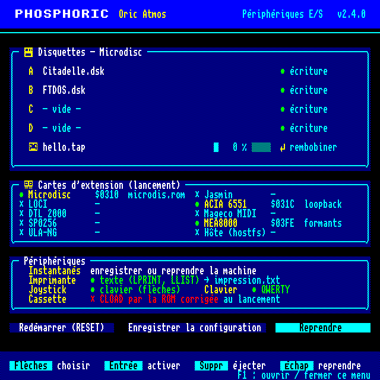
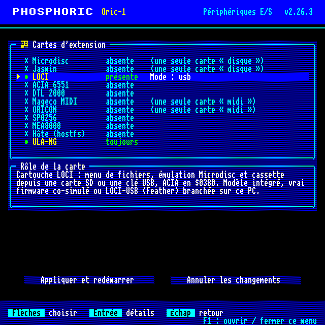
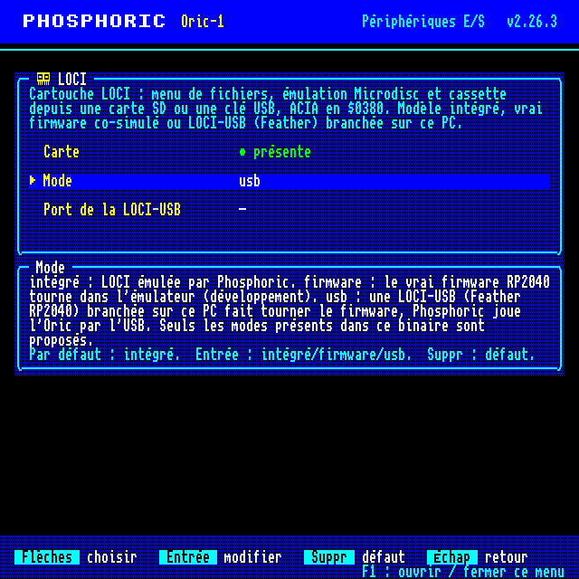

# Le menu F1 — manuel utilisateur

Le menu **F1** (« Périphériques E/S ») règle tout ce qui entoure l'Oric : disquettes,
cassette, cartes d'extension, instantanés, imprimante, joystick, clavier. Il remplace
la plupart des options de la ligne de commande pendant que la machine tourne.

## 1. Ouvrir et fermer

- **F1** ouvre le menu ; **F1** ou **Échap** le referme.
- Pendant que le menu est ouvert, **la machine est figée et le son coupé**. Elle
  reprend exactement où elle en était.
- Le menu occupe tout l'écran. Les touches tapées ne vont pas à l'Oric.
- Le dernier résultat (réussite en jaune, erreur en rouge) s'affiche au-dessus de la
  barre d'aide, par exemple « Lecteur A : SEDORIC.DSK ».

## 2. Les touches

La barre du bas rappelle les touches de la page en cours.

| Touche | Page principale | Sélecteur de fichiers | Page d'une carte |
|---|---|---|---|
| ↑ ↓ | changer de ligne | changer de fichier | changer de réglage |
| ← → | colonne d'une ligne (média / protection, rembobiner), passer d'un bouton à l'autre | ← : fermer le sélecteur | ← : revenir à la liste des cartes |
| Entrée | activer la ligne | choisir le fichier | modifier le réglage |
| Suppr ou Retour arrière | éjecter (lecteur, cassette) | — | remettre le réglage par défaut |
| Échap | reprendre la machine | fermer le sélecteur | revenir à la liste des cartes |
| Début / Fin | première / dernière ligne | premier / dernier fichier | — |
| Page préc. / Page suiv. | — | 20 fichiers plus haut / plus bas | — |
| Une lettre | — | aller au fichier suivant qui commence par cette lettre | — |

## 3. La page principale

### Disquettes A à D

Le titre du cadre indique l'interface disque en place : **Microdisc**, **Jasmin**,
**LOCI**, ou « pas d'interface disque ». Sans interface, rien ne se monte : il faut
d'abord activer une carte disque (section 4).

- **Entrée** sur un lecteur ouvre le sélecteur de fichiers (images `.dsk`). La
  première ligne, « Éjecter la disquette », vide le lecteur.
- **Suppr** éjecte directement.
- **→** puis **Entrée** bascule la **protection en écriture** du lecteur
  (« écriture » / « protégée »). Avec LOCI, il n'y a pas de protection par lecteur :
  cette colonne n'apparaît pas.
- Une même image ne peut pas être dans deux lecteurs à la fois (le menu refuse).
- Avec `--disk-writeback` au lancement, une disquette modifiée est réécrite dans son
  fichier `.dsk` quand on l'éjecte ou qu'on la remplace. Sans cette option, les
  écritures de l'Oric restent en mémoire et sont perdues à l'éjection. Avec la LOCI
  en mode `intégré`, l'éjection écrit les secteurs modifiés.
- « — absent — » : ce lecteur n'existe pas sur l'interface en place.
- Avec la LOCI en mode `firmware` ou `usb`, c'est son propre menu qui monte les
  disquettes (bouton MENU : **F8**) ; le menu F1 le rappelle.

### Cassette

- **Entrée** ouvre le sélecteur (fichiers `.tap`). La première ligne éjecte.
- **Suppr** éjecte.
- **→** puis **Entrée** rembobine la cassette au début.
- La ligne montre le nom, l'état du moteur, le pourcentage lu et une jauge.
- Une fois la cassette insérée, taper `CLOAD""` dans l'Oric.

### Cartes d'extension

Le cadre résume les cartes : **●** présente (avec son adresse et son réglage
principal), **✗** absente. **Entrée** sur ce cadre ouvre la liste des cartes
(section 4).

### Périphériques

| Ligne | Entrée fait | Détail |
|---|---|---|
| **Instantanés** | ouvre le sélecteur des `.ost` | première ligne « Enregistrer un nouvel instantané » → `snapshots/etatNNNN.ost` (numéro libre suivant). Choisir un instantané **reprend la machine à cet instant** et ferme le menu. |
| **Imprimante** | coupée → texte → traceur MCP-40 → coupée | texte : `LPRINT`, `LLIST` vont dans `impression.txt` ; traceur : `traceur.bmp`, écrit à la coupure. |
| **Joystick** | aucun → clavier → manette → aucun | clavier : flèches du clavier + tir ; manette : la première manette branchée (sinon elle est attendue). |
| **Clavier** | QWERTY ↔ AZERTY | disposition du clavier du PC traduite pour l'Oric. |
| **Cassette** (au lancement) | CLOAD par la ROM corrigée ↔ injection directe | ne vaut **qu'au prochain lancement** : penser à « Enregistrer la configuration ». |

### Les trois boutons

- **Redémarrer (RESET)** : comme F5, redémarre le 6502 (bouton reset de la LOCI si
  elle est là ; les disquettes restent montées) et ferme le menu.
- **Enregistrer la configuration** : écrit `phosphoric.cfg` (section 6).
- **Reprendre** : ferme le menu (comme Échap ou F1).

## 4. Les cartes d'extension

**Entrée** sur le cadre « Cartes d'extension » ouvre la liste. Chaque ligne montre
la carte, « présente » ou « absente », et une étoile rouge **\*** si elle a été
modifiée. Sous la liste, l'explication de la carte sélectionnée.

- **Entrée** sur une carte ouvre sa page.
- **Appliquer et redémarrer** relance l'émulateur avec les cartes choisies. C'est un
  **redémarrage à froid** : le programme se relance avec la même ligne de commande,
  moins les options de cartes, plus les nouvelles. La machine repart de zéro.
- **Annuler les changements** revient aux cartes de la machine en cours.
- Si deux cartes se chevauchent en mémoire, ou si un réglage manque, le menu
  l'indique en rouge et **refuse d'appliquer** (voir section 5).

### Page d'une carte

- Première ligne **Carte** : **Entrée** la rend présente ou absente.
- Puis un réglage par ligne, avec son explication en bas de page, sa valeur par
  défaut et ce que fait Entrée :

| Type de réglage | Entrée fait |
|---|---|
| fichier (ROM, image) | ouvre le sélecteur (dossiers `roms`, `roms/loci`, `disks`, `tapes`, `media` et le dossier courant) ; « Aucun fichier » vide la valeur |
| texte, dossier, nombre | ouvre la saisie : taper, **Entrée** valide, **Suppr** efface, **Échap** annule |
| adresse d'E/S | saisie en hexadécimal, contrôlée entre `0300` et `03FF` |
| oui / non | bascule |
| choix | passe à la valeur suivante |

**Suppr** remet le réglage à sa valeur par défaut.

### Groupes exclusifs

Une seule carte par groupe à la fois ; en activer une éteint l'autre :

- groupe **disque** : Microdisc, Jasmin, LOCI ;
- groupe **midi** : Mageco MIDI, ORICON.

### Les cartes et leurs réglages

| Carte | Rôle | Réglages (valeur par défaut) |
|---|---|---|
| **Microdisc** | contrôleur de disquettes Oric (WD1793), 4 lecteurs, en `$0310` | ROM du contrôleur (`roms/microdis.rom`) |
| **Jasmin** | contrôleur de disquettes Jasmin (WD177x, TDOS), en `$03F4` | ROM de démarrage (`roms/jasmin.rom`) |
| **LOCI** | cartouche LOCI, en `$03A0` ; voir ci-dessous | Mode, puis les réglages de ce mode |
| **ACIA 6551** | port série : modem, terminal, Minitel, BBS | Ligne série (`loopback`), Adresse d'E/S (`031C` ; `0380` pour l'ACIA de la LOCI), Vitesse (bauds) (vide : instantané), Tampon de réception (vide), Mode V23 (1200/75) (non) |
| **DTL 2000** | modem Digitelec (PIA 6821 + ACIA 6850), ligne V23 vers un serveur Minitel | Ligne V23 (`loopback`), Adresse d'E/S (`03F8`) |
| **Mageco MIDI** | interface MIDI (ACIA 6850 à 31 250 bauds) | Liaison MIDI (`loopback`), Adresse d'E/S (`03FE`) |
| **ORICON** | variante MIDI en `$031C` | Liaison MIDI (`loopback`) |
| **SP0256** | synthèse vocale Mageco (SP0256-AL2, allophones) | ROM d'allophones (`roms/al2.bin`), Adresse d'E/S (`03F1`) |
| **MEA8000** | synthèse vocale TMPI (formants, sans ROM) | Adresse d'E/S (`03FE`) |
| **Hôte (hostfs)** | dossier du PC monté dans l'Oric | Dossier monté (`.`) |
| **ULA-NG** | ULA étendue (palette, modes), toujours présente en `$0340` | aucun |

Valeurs possibles d'une **ligne série** (ACIA, DTL 2000) : `loopback` (écho local),
`tcp:hôte:port`, `modem:hôte:port` (appels entrants), `pty` (pseudo-terminal),
`com:bauds,bits,parité,stop,périphérique` (port série réel), `file:entrée[:sortie]`,
et pour l'ACIA seulement `picowifi[:ssid[:mot_de_passe]]` (modem Wi-Fi émulé).
**Liaison MIDI** : `loopback`, `midi[:cible]` (MIDI temps réel, si le binaire l'a),
`smf:fichier.mid[:loop]`, `tcp:hôte:port`, `file:entrée[:sortie]`.

Mageco MIDI et MEA8000 utilisent tous deux `$03FE` par défaut : changer l'adresse de
l'un pour les avoir ensemble.

### La carte LOCI et ses trois modes

Le premier réglage, **Mode**, choisit quelle LOCI ; **seuls les réglages du mode
choisi sont affichés** (les autres restent mémorisés, mais ne servent pas). En mode
`usb`, il ne reste que le port de la LOCI-USB :

Les trois modes :

| Mode | Ce que c'est | Réglages |
|---|---|---|
| `intégré` | LOCI émulée par Phosphoric (`--loci`) | **Démarrer sur le menu LOCI** (oui), **Image de carte SD**, **Dossier flash interne**, **Modem Wi-Fi (picowifi)** : aucun / simulé / réel, **Port du picowifi réel** (vide : détecté) |
| `firmware` | le vrai firmware RP2040 tourne dans l'émulateur (`--loci-emu`), pour développer le firmware | **Firmware (ELF)** (obligatoire), **Image flash du firmware** (vide : `<ELF>.flash`, « - » : volatile), **Image de clé USB** |
| `usb` | une **LOCI-USB** branchée sur le PC (`--loci-hw`) : une Feather RP2040 fait tourner le firmware LOCI, et Phosphoric joue l'Oric par l'USB | **Port de la LOCI-USB** (vide : détecté) |

- La Feather **est** la LOCI : ce n'est pas un pont vers une cartouche LOCI 1.3, et
  elle ne se branche pas sur un vrai Oric.
- Seuls les modes présents dans ce binaire sont proposés : `firmware` demande que
  `~/loci/emul` ait été là à la compilation, `usb` que `~/loci/loci-usb` y ait été
  (pas sous Windows).
- **Détection automatique** (Linux) : un port laissé vide est cherché d'après le nom
  USB de l'appareil (« PicoWifiModemUSB » pour le picowifi, « LOCI-USB… » pour la
  Feather). La recherche lit `/sys` sans ouvrir le port.
- Le **bouton MENU** de la LOCI est **F8** ; un appui de 2 secondes ou plus est un
  appui long (diagnostic).
- Modem LOCI et carte ACIA 6551 ne vont pas ensemble : une seule ligne série à la
  fois.

## 5. Messages d'erreur des cartes

| Message | Que faire |
|---|---|
| « X et Y se chevauchent en $03xx » | changer l'adresse d'E/S de l'une des deux |
| « Modem LOCI et ACIA 6551 : une seule ligne série à la fois » | retirer la carte ACIA, ou mettre le modem LOCI à « aucun » |
| « Modem LOCI réel : aucun picowifi USB détecté » | brancher le picowifi, ou indiquer son port |
| « LOCI : mode « … » absent de ce binaire » | choisir un autre mode (backend non compilé) |
| « LOCI firmware : indiquer le fichier ELF du firmware » | renseigner **Firmware (ELF)** |
| « LOCI-USB : aucune détectée (indiquer le port) » | brancher la Feather, ou indiquer son port |
| « Version web : les cartes se choisissent au lancement » | dans le navigateur, les cartes sont en lecture seule |

## 6. Enregistrer la configuration (`phosphoric.cfg`)

**Enregistrer la configuration** écrit `phosphoric.cfg` dans le dossier courant (ou
le fichier donné par `--config FICHIER`), une ligne `clé=valeur` par réglage :

| Clés | Contenu |
|---|---|
| `a=` … `d=` | images dans les lecteurs |
| `protection_a=oui` … | lecteurs protégés en écriture |
| `cassette=` | cassette insérée |
| `cassette_rapide=oui/non` | injection directe au lancement |
| `imprimante=non/texte/mcp40`, `imprimante_fichier=` | imprimante |
| `joystick=aucun/clavier/manette` | joystick |
| `clavier=qwerty/azerty` | clavier |
| `carte.<id>=oui/non` | cartes présentes (`microdisc`, `jasmin`, `loci`, `acia`, `dtl2000`, `mageco`, `oricon`, `sp0256`, `mea8000`, `hostfs`) |
| `<id>.<réglage>=valeur` | réglages de carte différents du défaut (ex. `loci.mode=usb`, `acia.adresse=0380`) |

Les lignes que le menu ne connaît pas sont conservées.

À la relecture, au lancement suivant :

- **la ligne de commande reste prioritaire** ; les cartes du fichier ne sont ajoutées
  que pour celles que la ligne de commande ne mentionne pas (`--no-config-cards` les
  ignore) ;
- le fichier n'est **pas lu en `--headless`**, sauf `--config FICHIER` explicite ;
- `--no-config` ou `PHOSPHORIC_NO_CONFIG=1` l'ignorent ;
- les anciennes clés restent lues (`interface_disque=`, `rom_disque=`,
  `carte.loci_emu`, `carte.loci_hw`, `loci.mode=réelle`, `loci.pont`…).

## 7. Divers

- `--menu-screenshot FICHIER` enregistre une image du menu (PPM 640 × 640) à la fin
  de l'exécution, menu ouvert ou non.
- Dans la version web, le menu fonctionne (médias, périphériques), mais les cartes ne
  se changent qu'au lancement.
- Les autres touches de fonction (F5 reset, F6 médias rapides, F8 bouton LOCI, F9
  débogueur, F12 capture…) sont décrites dans le [guide utilisateur](README.md).
